# Практическая работа №1

**Консольные утилиты настройки сетевых компонентов в ОС Windows**

---

## Цель работы

Получить практические навыки по конфигурированию сети в операционных системах Microsoft Windows,
ознакомится с утилитами командной строки, предназначенными для диагностики и настройки сети, разработать исполняемые
файлы, конфигурирующие сетевой интерфейс по заданным параметрам, ознакомиться с форматом записи пути до сетевого ресурса
UNC.

---

# Ход выполнения работы

---

## 1. Проверка свойств сетевого подключения

В ходе выполнения работы были открыты свойства используемого сетевого подключения (Wi-Fi адаптер).

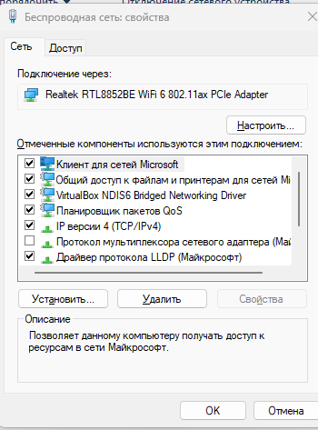

В свойствах подключения были проверены следующие компоненты:

* Клиент для сетей Microsoft
* Общий доступ к файлам и принтерам для сетей Microsoft
* Протокол Интернета версии 4 (TCP/IPv4)

Все указанные компоненты были активны.

---

### Назначение компонентов

**Клиент для сетей Microsoft**
Позволяет компьютеру подключаться к другим устройствам в сети и получать доступ к их ресурсам (общие папки, сетевые
диски, принтеры). Работает с использованием протокола SMB.

**Служба доступа к файлам и принтерам Microsoft**
Обеспечивает возможность предоставления ресурсов данного компьютера другим пользователям сети. При отключении данного
компонента другие устройства не смогут получить доступ к файлам и принтерам.

**Протокол TCP/IP**
Основной сетевой протокол, обеспечивающий передачу данных в сети.

* IP — отвечает за адресацию и маршрутизацию
* TCP — обеспечивает надежную доставку данных

---

## 2. Ограничение доступа к ресурсам

Для запрета доступа к ресурсам компьютера по сети был отключён компонент:

**Общий доступ к файлам и принтерам для сетей Microsoft**

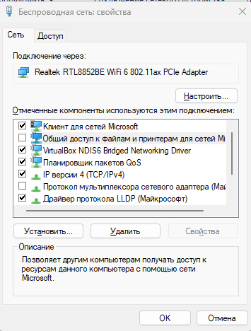

В результате компьютер перестал предоставлять доступ к своим ресурсам по протоколу SMB.

---

## 3. Работа с утилитой `ping`

### Назначение

Утилита `ping` используется для проверки доступности удалённого узла и измерения времени отклика.

---

### a) Проверка доступности

```cmd
ping my.itmo.ru
```

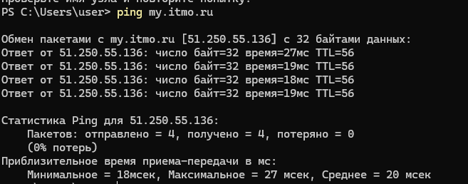

Результат:

* узел доступен
* потерь пакетов нет
* среднее время ≈ 20 мс

---

### b) Бесконечная проверка

```cmd
ping -t my.itmo.ru
```

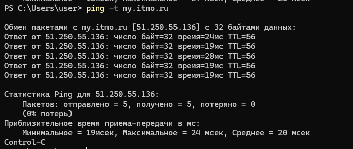

Команда выполнялась до ручной остановки (Ctrl+C). Потерь не наблюдалось.

---

### c) Ограничение числа запросов

```cmd
ping -n 5 my.itmo.ru
```

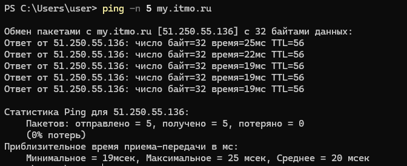

Было отправлено 5 пакетов, все успешно получены.

---

### d) Изменение размера пакета

```cmd
ping -l 1000 my.itmo.ru
```

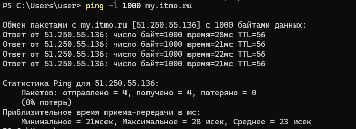

Увеличение размера пакета не привело к потерям, задержка немного увеличилась.

---

### e) Сохранение результата

```cmd
ping my.itmo.ru > file_3f.txt
```

Результаты были сохранены в файл.

---

## 4. Работа с утилитой `tracert`

### Назначение

Команда `tracert` позволяет определить маршрут прохождения пакетов до удалённого узла.

---

### a) Определение маршрута

```cmd
tracert my.itmo.ru
```

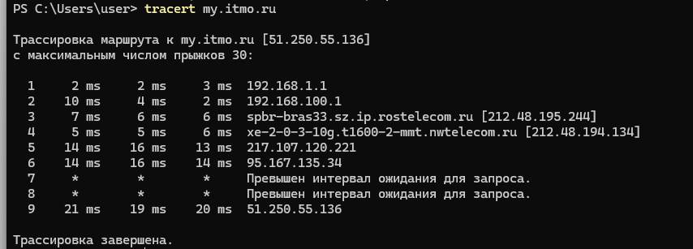

Маршрут проходит через:

* локальный роутер
* сеть провайдера
* промежуточные узлы

Некоторые узлы не отвечают (`*`), что допустимо.

---

### b) Ограничение числа хопов

```cmd
tracert -h 10 my.itmo.ru
```

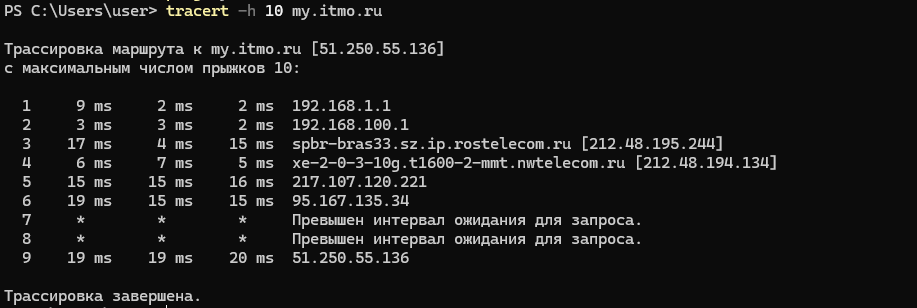

Маршрут ограничен 10 узлами.

---

### c) Изменение времени ожидания

```cmd
tracert -w 150 my.itmo.ru
```

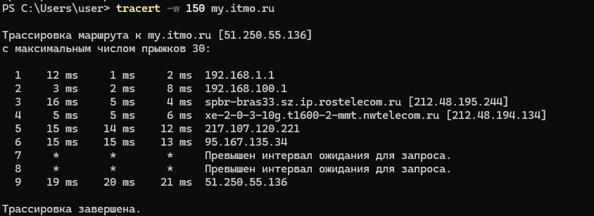

Увеличение таймаута позволило получить больше ответов от узлов.

---

## 5. Утилита `ipconfig` и `net`

---

### 5.1 Утилита `ipconfig`

#### a) Просмотр конфигурации

```cmd
ipconfig
```

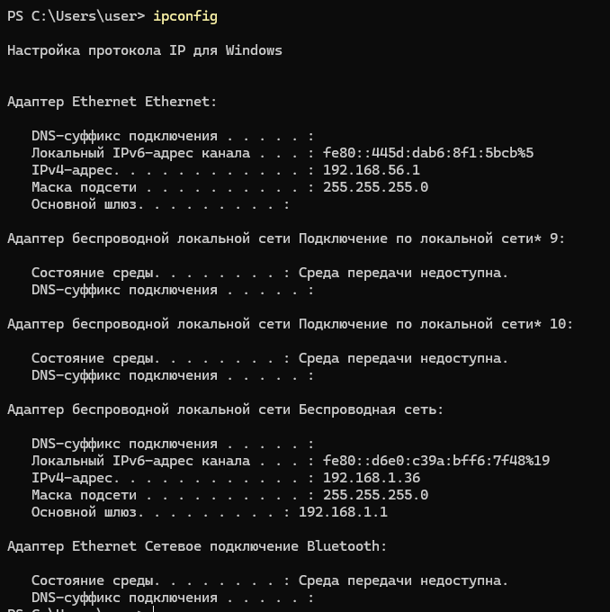

---

#### b) Полная информация

```cmd
ipconfig /all
```

```
PS C:\Users\user> ipconfig /all

Настройка протокола IP для Windows

   Имя компьютера  . . . . . . . . . : MurSystem
   Основной DNS-суффикс  . . . . . . :
   Тип узла. . . . . . . . . . . . . : Гибридный
   IP-маршрутизация включена . . . . : Нет
   WINS-прокси включен . . . . . . . : Нет

Адаптер Ethernet Ethernet:

   DNS-суффикс подключения . . . . . :
   Описание. . . . . . . . . . . . . : VirtualBox Host-Only Ethernet Adapter
   Физический адрес. . . . . . . . . : 0A-00-27-00-00-05
   DHCP включен. . . . . . . . . . . : Нет
   Автонастройка включена. . . . . . : Да
   Локальный IPv6-адрес канала . . . : fe80::445d:dab6:8f1:5bcb%5(Основной)
   IPv4-адрес. . . . . . . . . . . . : 192.168.56.1(Основной)
   Маска подсети . . . . . . . . . . : 255.255.255.0
   Основной шлюз. . . . . . . . . :
   IAID DHCPv6 . . . . . . . . . . . : 789184551
   DUID клиента DHCPv6 . . . . . . . : 00-01-01-00-31-2E-96-F6-7C-FA-80-A6-56-03
   NetBios через TCP/IP. . . . . . . . : Включен

Адаптер беспроводной локальной сети Подключение по локальной сети* 9:

   Состояние среды. . . . . . . . : Среда передачи недоступна.
   DNS-суффикс подключения . . . . . :
   Описание. . . . . . . . . . . . . : Microsoft Wi-Fi Direct Virtual Adapter
   Физический адрес. . . . . . . . . : 7E-FA-80-A6-56-03
   DHCP включен. . . . . . . . . . . : Да
   Автонастройка включена. . . . . . : Да

Адаптер беспроводной локальной сети Подключение по локальной сети* 10:

   Состояние среды. . . . . . . . : Среда передачи недоступна.
   DNS-суффикс подключения . . . . . :
   Описание. . . . . . . . . . . . . : Microsoft Wi-Fi Direct Virtual Adapter #2
   Физический адрес. . . . . . . . . : 72-FA-80-A6-56-03
   DHCP включен. . . . . . . . . . . : Да
   Автонастройка включена. . . . . . : Да

Адаптер беспроводной локальной сети Беспроводная сеть:

   DNS-суффикс подключения . . . . . :
   Описание. . . . . . . . . . . . . : Realtek RTL8852BE WiFi 6 802.11ax PCIe Adapter
   Физический адрес. . . . . . . . . : 7C-FA-80-A6-56-03
   DHCP включен. . . . . . . . . . . : Да
   Автонастройка включена. . . . . . : Да
   Локальный IPv6-адрес канала . . . : fe80::d6e0:c39a:bff6:7f48%19(Основной)
   IPv4-адрес. . . . . . . . . . . . : 192.168.1.36(Основной)
   Маска подсети . . . . . . . . . . : 255.255.255.0
   Аренда получена. . . . . . . . . . : 22 марта 2026 г. 12:15:05
   Срок аренды истекает. . . . . . . . . . : 22 марта 2026 г. 19:34:34
   Основной шлюз. . . . . . . . . : 192.168.1.1
   DHCP-сервер. . . . . . . . . . . : 192.168.1.1
   IAID DHCPv6 . . . . . . . . . . . : 360512128
   DUID клиента DHCPv6 . . . . . . . : 00-01-01-00-31-2E-96-F6-7C-FA-80-A6-56-03
   DNS-серверы. . . . . . . . . . . : 192.168.1.1
   NetBios через TCP/IP. . . . . . . . : Включен

Адаптер Ethernet Сетевое подключение Bluetooth:

   Состояние среды. . . . . . . . : Среда передачи недоступна.
   DNS-суффикс подключения . . . . . :
   Описание. . . . . . . . . . . . . : Bluetooth Device (Personal Area Network)
   Физический адрес. . . . . . . . . : 7C-FA-80-A6-56-04
   DHCP включен. . . . . . . . . . . : Да
   Автонастройка включена. . . . . . : Да
```

---

#### c) Обновление IP

```cmd
ipconfig /renew
```

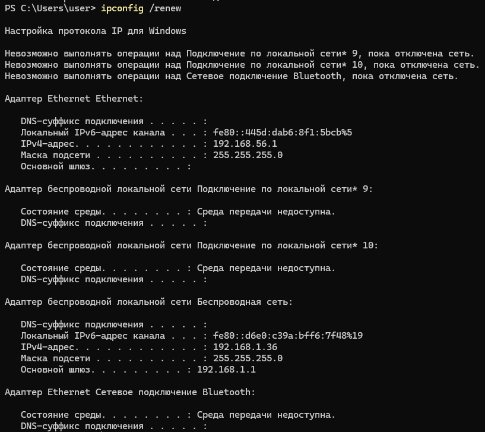

---

#### d) Очистка DNS-кэша

```cmd
ipconfig /flushdns
```

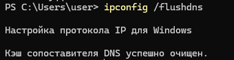

---

#### e) Просмотр DNS-кэша

```cmd
ipconfig /displaydns
```

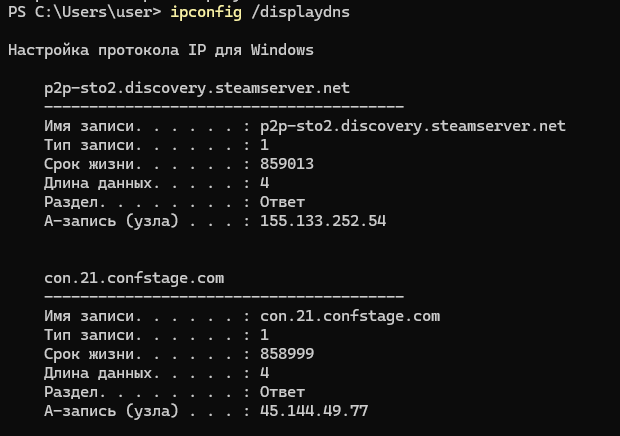

---

### 5.2 Утилита `net`

#### a) Просмотр открытых файлов

```cmd
net file
```

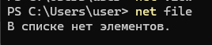

---

#### b) Статистика

```cmd
net statistics workstation
```

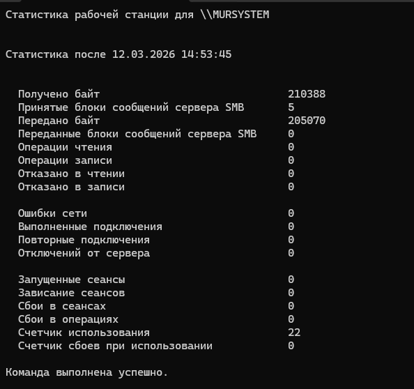

---

#### c) Конфигурация станции

```cmd
net config workstation
```

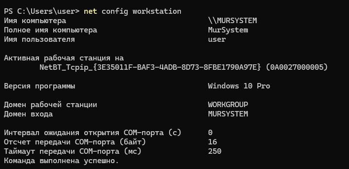

---

#### d) Конфигурация сервера

```cmd
net config server
```

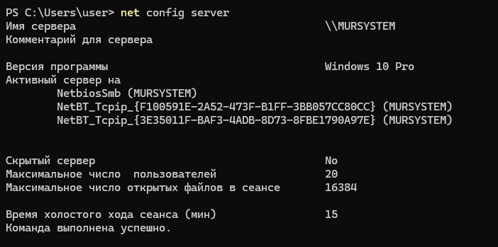

---

## 6. Скрипт на CMD (netsh)

Был разработан BAT-скрипт для настройки интерфейса (см Lab1/files/script.bat)

### Возможности:

* DHCP режим
* статическая настройка

Пример запуска:
```cmd
script.bat dhcp "Беспроводная сеть"
script.bat static "Беспроводная сеть" 192.168.1.100 255.255.255.0 192.168.1.1 8.8.8.8
```

Результат проверки:

```cmd
netsh interface ip show config name="Беспроводная сеть"
```

Скрипт корректно изменяет настройки сети.

---

## 7. Скрипт PowerShell

Реализован аналогичный скрипт на PowerShell (см Lab1/files/script.ps1).

### Возможности:

* DHCP
* Static
* Info (дополнительно)

Пример работы:

```powershell
./script.ps1
```

Вывод:

* модель адаптера
* MAC-адрес
* статус подключения
* скорость
* duplex

---

# Ответы на вопросы

---

### 1. Запрет доступа через интерфейс

* Через брандмауэр Windows → создать правило → выбрать интерфейс → запретить подключение
* Или отключить:

    * сетевое обнаружение
    * общий доступ к файлам

---

### 2. Команда `net`

| Команда        | Назначение           |
|----------------|----------------------|
| net use        | подключение ресурсов |
| net view       | просмотр сети        |
| net stop/start | управление службами  |
| net share      | управление папками   |
| net config     | настройки            |
| net session    | сеансы               |
| net user       | пользователи         |
| net statistics | статистика           |
| net localgroup | группы               |

---

### 3. Как узнать DNS

```cmd
ipconfig /all
```

---

### 4. Команда net use

```cmd
net use R: \\SRV\TEST
```

Подключает сетевую папку как диск.

---

### 5. Переименование интерфейса

```powershell
Rename-NetAdapter -Name "Старое" -NewName "Новое"
```

---

### 6. Режимы duplex

* Полудуплекс — передача в одну сторону
* Полный дуплекс — одновременная передача
* Авто — автоматический выбор

---

# Вывод

В ходе работы были изучены основные консольные утилиты Windows (`ping`, `tracert`, `ipconfig`, `net`, `netsh`) и их
параметры. Были получены практические навыки диагностики сети и настройки сетевых интерфейсов, а также разработаны
скрипты для автоматизации этих процессов.
